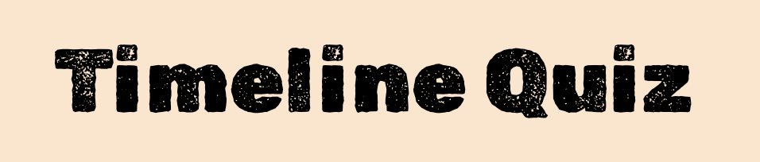
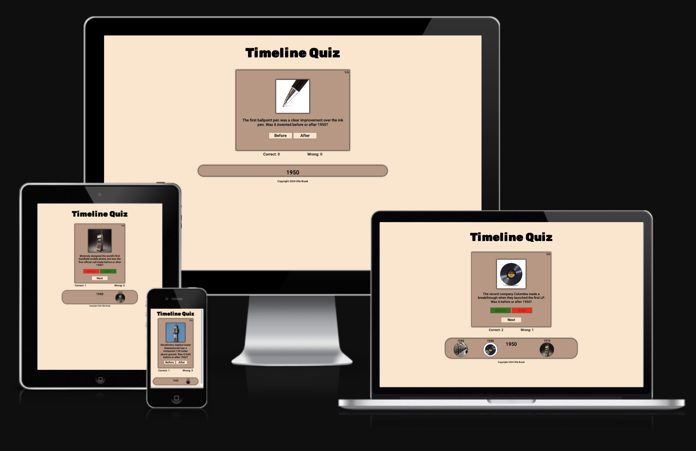
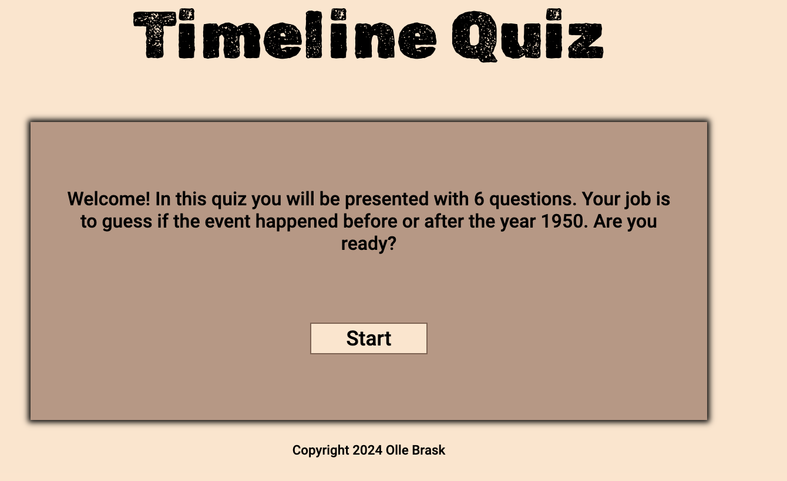
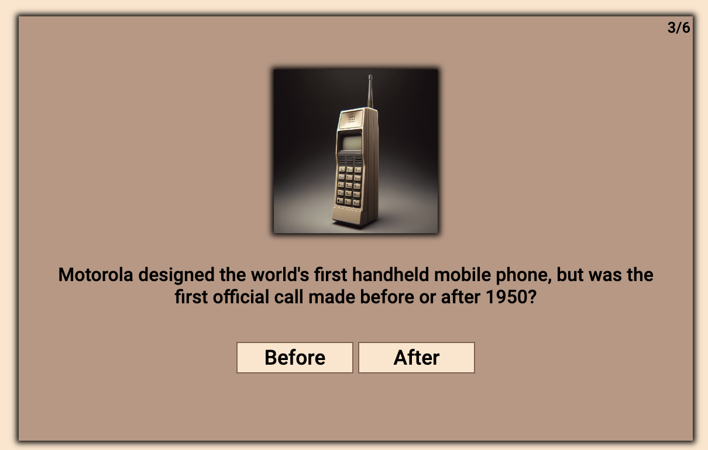
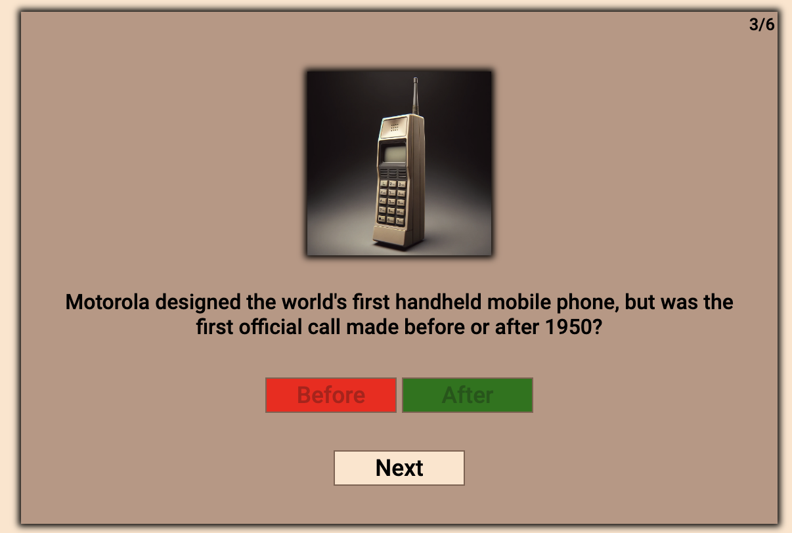
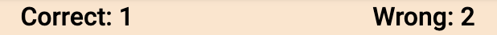
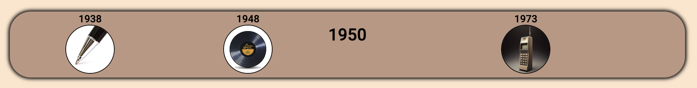
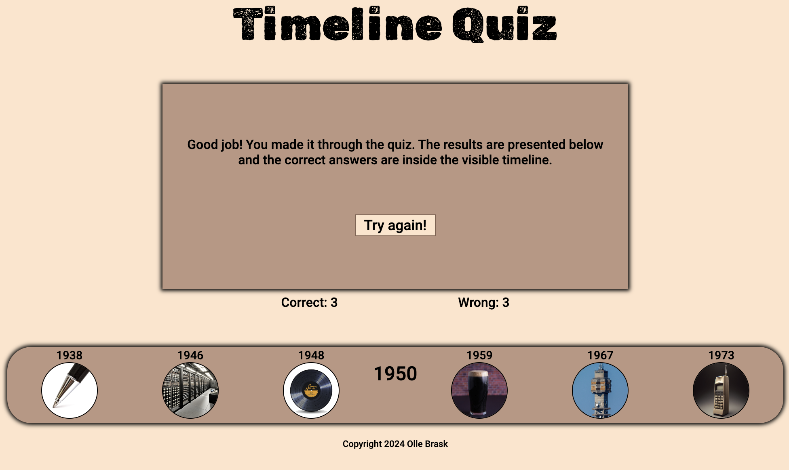
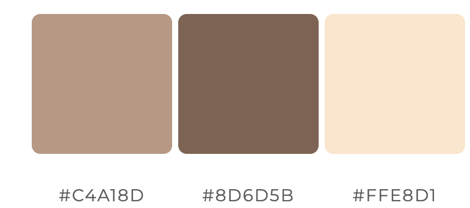

---

# *Timeline Quiz*

The Timeline Quiz website allows people to learn about when a few events or products happened.

The site can be accessed by this [link](https://ollebrask.github.io/timeline-quiz/)

---
## User Stories

The site will be a clean one-page application, with a clear interface to allow for a quick understanding of the page content and purpose. Since the site is a quiz, the new visitors and returning visitors goals will be the same.

The user should be able to:
- Read up on how the quiz works, by the information on first page.
- Track their score in real-time after each question is answered.
- See the correct year for each quiz-question displayed at the timeline at the bottom after answering.
- Have a visual indication of which was the right or wrong answer once they have made their choice.
- Have an option to reset the quiz and start again.

## Features

+ ### Home Page

    - Represent: 

        - A welcome message and information about the quiz.
        - A start button.

    

---

+ #### Quiz

    - The quiz randomly shows an image and the paired question.

    - A button for "before" and a button for "After".

    - The current question number is visual at the top right corner.

    
    

+ #### Before and After

    - When pressing "Before" or "After" the correct answer will turn green, and the incorrect will turn red.

    - Next button appears

    
    

+ #### Counter

    - There is a counter for Correct answers and on for Wrong answers.

    - It adds the score +1 depending on if its a correct or incorrect answer.

    
    

+ #### Timeline

    - When pressing "Before" or "After" the image and correct year will be visual on the timeline.
    
    

+ #### See result

    - When quiz is finished you can press "See result" button.

    - A message is shown and a "Try again" button. It will refresh the page.

    
    

+ #### Footer

    - A centered text showing: Copyright 2024 Olle Brask

    
    

---
## Technologies Used

- [HTML](https://developer.mozilla.org/en-US/docs/Web/HTML) was used as the foundation of the site.
- [CSS](https://developer.mozilla.org/en-US/docs/Web/css) - was used to add the styles and layout of the site.
- [CSS Flexbox](https://developer.mozilla.org/en-US/docs/Learn/CSS/CSS_layout/Flexbox) - was used to arrange items on the pages.
- [Balsamiq](https://balsamiq.com/) was used to make wireframe for the website.
- [VSCode](https://code.visualstudio.com/) was used as the main tool to write and edit code.
- [Git](https://git-scm.com/) was used for the version control of the website.
- [GitHub](https://github.com/) was used to host the code of the website.
- [Adobe Firefly](https://adobe.com/products/firefly.html/) was used to generate the image of the phone, computer and beer for the webpage.
- [Mostphotos](https://www.mostphotos.com/) were used for the image of the tower, LP and pen.
- [Birme](https://www.birme.net) was used to optimize images.

---
## Design

### Color Scheme

- The colors used was generated with [ColorSpace](https://mycolor.space/).

### Typography

- Bebas Neue Google Font was used as the main font.

### Wireframes
- [Home Page](documentation/index-wireframe.png)
- [Services](documentation/services-wireframe.png)
- [Contact Page](documentation/contact-wireframe.png)
- [Response Page](documentation/response-wireframe.png)

---

## Testing

Please refer to the [TESTING.md](TESTING.md) file for all test-related documentation.

---

## Deployment

### Deployment to GitHub Pages

- The site was deployed to GitHub pages. The steps to deploy are as follows: 
  - In the [GitHub repository](https://github.com/ollebrask/timeline-quiz/), navigate to the Settings tab 
  - From the source section drop-down menu, select the **Main** Branch, then click "Save".
  - The page will be automatically refreshed with a detailed ribbon display to indicate the successful deployment.

The live link can be found [here](https://ollebrask.github.io/timeline-quiz/)

### Local Deployment

To make a local copy of this project, you can clone it.
In your IDE Terminal, type the following command to clone my repository:

- `git clone https://github.com/ollebrask/timeline-quiz.git`

---

## Future improvements
- I will make back-end programming for the form on the Contact us page.
- I will make a 404 error page for the website.

---
## Credits

+ #### Content

    - The structure of the README/TESTING file came from my mentor Iuliia Konovalova's Animal Shelter Project [Animal Shelter README](https://github.com/IuliiaKonovalova/animal_shelter/blob/main/README.md)
    - Inspiration for the shuffling question and keeping track of current question from Web Dev Simplified YouTube page.
    - Inspiration for the counter came from the Code Institutes: Love Math Walkthrough Project.

+ #### Media

    - All the images for the website were generated with [Adobe Firefly](https://adobe.com/products/firefly.html/).
    - The images were optimized with [Birme](https://www.birme.net).

+ #### Other

    - Github was used to store my repository and for free deployments. [GitHub](https://github.com)
    - Visual Studio Code was used as code editor. [Visual Studio Code](https://code.visualstudio.com)    
---

## Acknowledgments

- [Iuliia Konovalova](https://github.com/IuliiaKonovalova) my mentor, thank you for your support with VS Code and feedback during the project.
- [Kevin Powell](https://www.youtube.com/user/KepowOb) for his flexbox tutorials.

- My friend Pontus Karlström, who recently started the Cinnova company and let me use his company as my first project.