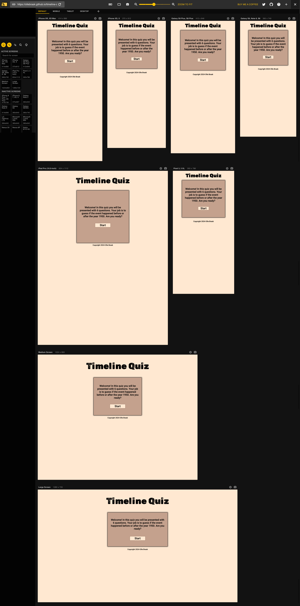

# TESTING

## Compatibility

In order to confirm the correct functionality, responsiveness, and appearance:

+ The website was tested on the following browsers: Chrome and Safari

    - Chrome:

    

    - Safari:

    

## Responsiveness

+ The website was checked by devtools implemented in Chrome.

+ The website was checked with [Responsive Viewer addon for Chrome](https://responsiveviewer.org/).

    - Index page

    

    - Question:

    

    - Summary:

    

## Manual testing

| feature | action | expected result | tested | passed | comments |
| --- | --- | --- | --- | --- | --- |
| Start | | | | | |
| Start | Click on the "Start" button | First random question is displayed | Yes | Yes | - |
| Start | Click on the "Start" button | Question number 1/6 is displayed | Yes | Yes | - |
| Start | Click on the "Start" button | Correct/wrong answers is displayed | Yes | Yes | - |
| Start | Click on the "Start" button | Timeline is displayed | Yes | Yes | - |
| Before/After | | | | | |
| Before/After | Click on the "Before" or "After" button | The correct button turns green | Yes | Yes | - |
| Before/After | Click on the "Before" or "After" button | The incorrect button turns green | Yes | Yes | - |
| Before/After | Click on the "Before" or "After" button | The Correct/Wrong score is increased by 1 | Yes | Yes | - |
| Before/After | Click on the "Before" or "After" button | The image and correct year is displayed in the timeline | Yes | Yes | - |
| Before/After | Click on the "Before" or "After" button | If there are questions left, next button is displayed | Yes | Yes | - |
| Before/After | Click on the "Before" or "After" button | If all questions have displayed, see result button is displayed | Yes | Yes | - |
| Next | | | | | |
| Next | Click on the "Next" button | Next random question is displayed | Yes | Yes | - |
| Next | Click on the "Next" button | Question number is increased by 1 | Yes | Yes | - |
| Result | | | | | |
| Result | Click on the "See results" button | Summary text is displayed | Yes | Yes | - |
| Result | Click on the "See results" button | Retry button is displayed | Yes | Yes | - |
| Retry | | | | | |
| Result | Click on the "Try again" button | Page is refreshed | Yes | Yes | - |

---
## Validator testing
+ ### HTML
    No errors or warnings were found when passing through the official W3C validator.

    
    
 
    
+ ### CSS
    No errors or warnings were found when passing through the official W3C (Jigsaw) validator:
    

    

+ ### JSHINT
    No errors or warnings were found when passing through the official W3C (Jigsaw) validator:
    

    
  
 

+ ## LightHouse report

    - Using lighthouse in devtools I confirmed that the website is performing well.

  

---
+ ### Bugs
    - The function revealTimeline didn't work. That was because because I did not have correctYear inside the parantheses. It's needed to define what year the function is looking for.
    - I tried to apply hide to .timeline section. It didn't work because the .hide code was above the .timeline code in the css file.
+ ### Unsolved bugs
    - None.
---